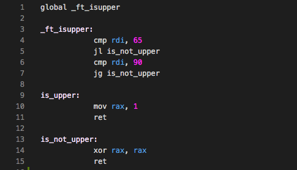

# Libasm
The aim of this project is to get familiar with assembly language.

# The language
An assembly language is a low-level programming language designed for a specific type of processor. In the this project, I will focus on the Intel x86–64 syntax. The assembly language describes the succession of commands your processor will execute. One line means one instruction.  Most programs consist of **directives** followed by one or more **sections**. Lines can have an optional **label**. Most lines have an **instruction** followed by zero or more **operands** To better understand this project I highly recommend [this article.](https://medium.com/a-42-journey/a-quick-guide-to-code-your-first-assembly-functions-43c2032ebfda)

# General
The project contains basic functions in Assembly using the x86 Intel syntax.

## Requirements
- nasm - to install just type `brew install nasm` in the command line.
